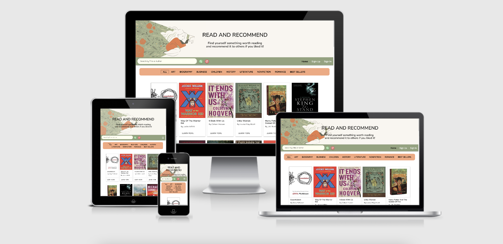

# Maryam Abdolbeigi

## Read And Recommend
       
[The Website In Action](https://read-and-recommend.herokuapp.com/)

This is a book recommendation website that provides a shopping link for all books on the website as well as the book's detail and description.
On this website, users can find a summary of their favorite book, refer to the online store, become a member and write a review about books, and most importantly, add their favorite books to the website.

## UX
---
The effort has been put for this website to be as intuitive as possible. 

### The business objectives of this website are:

- Refer users to Amazon online bookstore and make revenue from each purchase.
- Classify the books on the database based on their category and present them on the website so that they are easy to find and learn about.

###  The customer objectives of this website are:

- Find a worth reading book and head over to the online store to buy it.
- Find out about other readers' reviews and opinions about their favorite book.
- Be able to share their own opinion about a book.

### The Ideal customer for this website:
- Is a book lover and is into reading.
- Is a fan of online shopping.

### User Stories:

1. As a first time visitor, I would like to find a worth reading book.
2. As a first time visitor, I would like to find out more about my favorite book and read other readers' reviews.
3. As a first time visitor, I would like to become a member of the community to be able to add my favorite book to the website.
4. As a returning visitor, I would like to edit my profile and info.
5. As a returning visitor, I would like to write a review about a book I have recently read / purchased from the online store.
6. As a returning visitor, I would like to find an interesting book to read.

### Wireframe Mockups:                              
                          
Home page:                  
[Desktop wireframes PDF](static/readme-assets/wireframes/home.pdf)        

Profile Page:             
[iPad wireframes PDF](static/readme-assets/wireframes/profile.pdf)     

Edit Profile Page:            
[Mobile wireframes PDF](static/readme-assets/wireframes/edit-profile.pdf) 

Login Page:            
[Mobile wireframes PDF](static/readme-assets/wireframes/login.pdf)           

Sign Up Page:            
[Mobile wireframes PDF](static/readme-assets/wireframes/sign-up.pdf) 

Book Detail Page:            
[Mobile wireframes PDF](static/readme-assets/wireframes/books.pdf) 

Add a Book Page:            
[Mobile wireframes PDF](static/readme-assets/wireframes/add-a-book.pdf) 

## Features-
### Existing Features

* #### Design in Depth
     * 
     

     * The font families used in this project are:
          * 'Quicksand' for the body text and other elements.
          * '#' for the headlines and navigation links.
          * Sans-serif for the fallback font.

*   #### Navigation Bar     
    * Featured on home page to allow for easy navigation.
    * This section will allow the user to easily navigate from page to page across all devices without having to revert back to the previous page via the back button.
    * The navigation bar collapses from medium screen sizes to a hamburger icon, which unfolds to a navigation drawer when clicked.

*  #### Landing page provides:
    * A search box which in user can search for their favorite books by title.
    * Category classification bar which display different categories.
    * Each link on the category bar filters the display of the books based on thier category on the page.

### Yet to be implemented
   

## Technologies Used

### Languages
- HTML5
- CSS
- JavaScript
- Python3
- Dockerfile

### IDE
- VScode

### Frameworks, Libraries, CDN's, resources:

1. [Materialize]()       
- This was used for the main layout, forms, alerts and other elements. 

2. [Balsamiq](https://balsamiq.com/wireframes/)         
- This was used to create mockups during the design process.      

3. [GitHub](https://github.com/)         
- Github was used as a remote repository and to deploy the website.      

4. [Git](https://git-scm.com/)         
- Git was used as version control to keep track of files and push them to the remote repository.      

5. [FontAwesome](https://fontawesome.com/start)         
- Font Awesome was used throughout the website to add icons.      

6. [Google Fonts](https://fonts.google.com/)         
- Google fonts were used to import the font styles in the website.      

7. [Chrome Developer Tools:](https://developer.chrome.com/docs/devtools/)        
- This was used for debugging and for checking the responsiveness of the website.      

8. [Ami Responsive](http://ami.responsivedesign.is/)         
- This was used to test the website responsiveness.      

9. [HTMLValidationService](https://validator.w3.org/)     
- This was used to check the markup validity of the web documents.      

10. [CSSValidationService](https://validator.w3.org/)      
- This was used to check the markup validity of the web documents.      

11. [Coolors.co](https://coolors.co/eae8ed-bcdadd-b3d1bb-62a9af-af70c2-500966)     
- This was used to choose the color theme used in the website.      

12. [Unicorn Revealer Extention](https://chrome.google.com/webstore/detail/unicorn-revealer/lmlkphhdlngaicolpmaakfmhplagoaln?hl=en-GB)        
- This is a developer-friendly tool to locate the overflows and was used throughout the process.              

13. [w3schools](https://www.w3schools/)         
- This was used for documentation for most troubles and errors.      

14. [jQuery](https://jquery.com/)      
- This was used as Javascript library to write less Javascript codes.          

15. [Pinterest](https://nl.pinterest.com/)        
- This was used to download images for the website.      

16. [favicon.io](https://favicon.io/)       
- This was used to create and insert a favicon.      

## Testing
Testing information can be found in a separate [TESTING.md file](TESTING.md)
## Deployment

### Github
1. Log into Github and locate the relevant repository.
2. Click on the settings buttons on the menu.
3. Scroll down to the "Github pages".
4. Click on the link "Check it out here".
5. Change the branch from "none" to "main/master".
6. Click on the "save" button.
7. It might take a couple of minutes to retrieve the link to the published website in a green box.
8. Add the link of the website to the "About" section of the repository and include a short description of the project.
9. Click "Save Changes" and the link will be available in the About section of the repository.

### Forking the GitHub Repository
1. Sign in to GitHub and locate the GitHub Repository.
2. Go to the top right side of the screen and below the navigation bar is the "Fork" button.
3. After clicking this, you will now have a copy of the original Repository in your GitHub account.

### Local Clone
This is used to make changes to the project code.

1. log in to Github and locate the intended repository.
2. Above the Repository files, click on the "Code" button.
3. You then see three options, HTTPS, SSH and GitHub CLI. Select one and copy the URL.
4. Open a new terminal on Git Bash.
5. Now change the current working directory to the location you'd like the cloned directory to be made.
6. Type git clone, and then paste the URL you copied from the remote repository.

`$ git clone https://github.com/Yasi92/read-and-recommend.git`

### Author 

## Credits

- [Stackoverflow](https://stackoverflow.com/)
- [w3schools](https://www.w3schools/howto/tryit.asp?filename=tryhow_js_scroll_to_top)

## Content
                   
         

## Media
 The photots throughout the website were taken from:
- [Pexels](https://www.pexels.com/)  
- [Pinterest](https://nl.pinterest.com/)

## Acknowledgements

- Tutors at Code Institute for their continued support.
- Code Institute's Slack community was a great help every step of the way during the project.
- Stack Overflow.
- My mentor Richard Will.
- Code Institute's Slack community was a great help every step of the way during the project.

