# Maryam Abdolbeigi

## Read And Recommend
       
[The Website In Action](https://read-and-recommend.herokuapp.com/)

This is a book recommendation website that provides a shopping link for all books on the website as well as the book's detail and description.
On this website, users can find a summary of their favorite book, refer to the online store, become a member and write a review about books, and most importantly, add their favorite books to the website.          

## UX
---
The effort has been put into this website to be as intuitive as possible. 
All pages on this website are responsive to desktop, iPad and, mobile screens.

### The business objectives of this website are:

- Refer users to Amazon online bookstore and make revenue from each purchase.
- Classify the books on the database based on their category and present them on the website so that they are easy to find and learn about.

###  The customer objectives of this website are:

- Find a worth reading book and head over to the online store to buy it.
- Find out about other readers' reviews and opinions about their favorite book.
- Be able to share their own opinion about a book.

### The Ideal customer for this website:
- Is a book lover and is into reading.
- Is a fan of online shopping.

### User Stories:

1. As a first time visitor, I would like to find a worth reading book.
2. As a first time visitor, I would like to find out more about my favorite book and read other readers' reviews.
3. As a first time visitor, I would like to become a member of the community to be able to add my favorite book to the website.
4. As a returning visitor, I would like to edit my profile and info.
5. As a returning visitor, I would like to write a review about a book I have recently read / purchased from the online store.
6. As a returning visitor, I would like to find an interesting book to read.

### Wireframe Mockups:                              
                          
Home page:                  
[Home page wireframes PDF](static/readme-assets/wireframes/home.pdf)        

Profile Page:             
[Profile Page wireframes PDF](static/readme-assets/wireframes/profile.pdf)     

Edit Profile Page:            
[Edit Profile wireframes PDF](static/readme-assets/wireframes/edit-profile.pdf) 

sign-In Page:            
[Login Page wireframes PDF](static/readme-assets/wireframes/login.pdf)           

Sign-Up Page:            
[Sign Up Page wireframes PDF](static/readme-assets/wireframes/sign-up.pdf) 

Book Detail Page:            
[Book Detail Page wireframes PDF](static/readme-assets/wireframes/books.pdf) 

Add a Book / Edit Book Page:            
[MobAdd a Book Pageile wireframes PDF](static/readme-assets/wireframes/add-a-book.pdf) 

### Flowchart:
[Registeration and sign-in flowchart](static/readme-assets/readme-img/Login-sign-up.drawio.png) 

## Features-
### Existing Features

* #### Design in Depth
     * The main colors used for the design are taken from the header image and an effort has been put to keep the colors as relevant as possible.
     

     * The font families used in this project are:
          * 'Quicksand' for the body text and other elements.
          * 'Nunito' for the headlines and navigation links.
          *  Sans-serif for the fallback font.

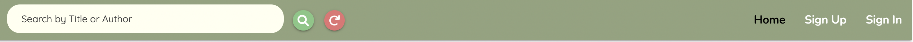
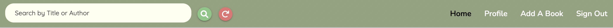

*   #### Navigation Bar     
    * Featured on all pages to allow for easy navigation.
    * This section will allow user to easily navigate from page to page across all devices without having to revert back to the previous page via the back button.
    * The navigation bar displays different links such as "Profile", "Add a Book" and "Sign Out" if the user is logged in and, "Sign In" and "Sign Up" if the user has not logged in.
    * The navigation bar collapses from medium screen sizes to a hamburger icon, which unfolds to a navigation drawer when clicked.
    * The search box is embeded in the navigation bar on home page, where all books are displayed for a quick search by title or author. 

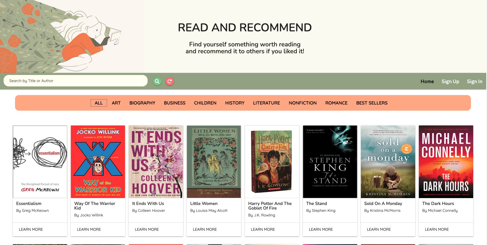
*  #### Landing page provides:
    * A search box in which users can search for their favorite books by title or author.
    * Category collection bar which filters books by their category.
    * Small book cards with image, title and author name, which on click navigates users to a page with full information of each book.            

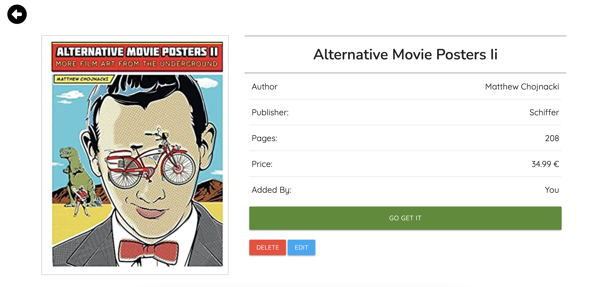
*  #### Book Detail page provides:
    * A full image of the book cover.
    * Full information of the book such as title, author, publisher, price, pages and, name of the user who added the book.
    * A "Go get it" button that navigates users to the online store in a new tab.
    * A back button which redirects to the previous page.
    * A best seller badge is embedded in the title box if the book falls in the best seller collection.
    * If the book is added by the user, the "Delete" and "Edit" buttons will be shown underneath the book details to enable the user to delete or edit the added book.
    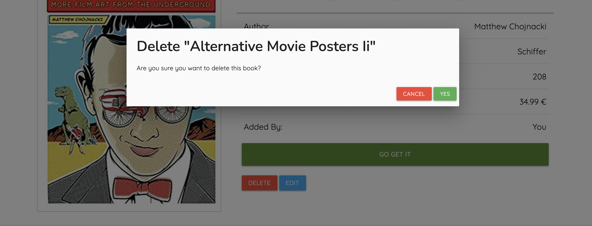
    * The "Delete" button opens to a modal for delete confirmation and removes the book from the database if confirmed by the user and returns to the same page with book details if ignored.
    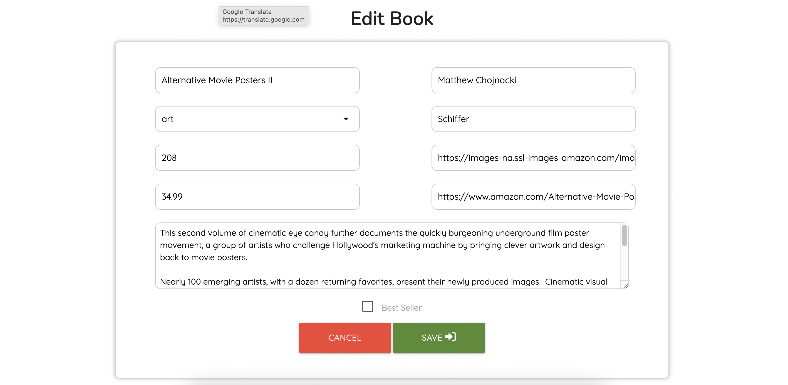
    * The "Edit" button redirects to the edit book page with a form where all the inputs are pre-filled with the book details and the user is able to make any change to the book and submit it.
    
    * Short description of the book which expands on "Read More" click.
    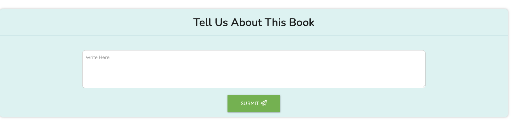
    * With the review form users can compose a review which will be inserted in the database and displayed in the review section in detail.
    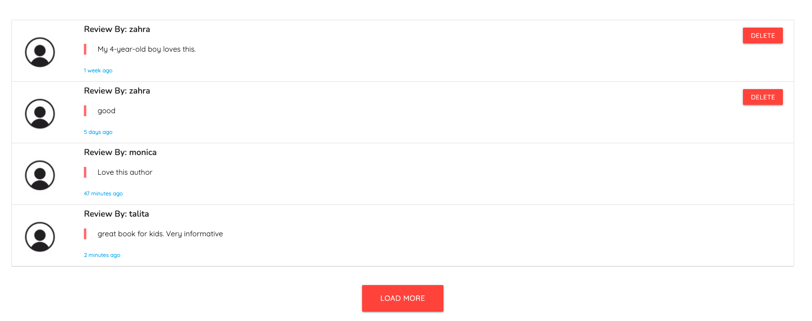
    * Display reviews
    * In this section all corresponding reviews of the book are displayed in a list which are visible in slices of 4 and can be expanded to more reviews by clicking on the "Load More" button.
    * The creation date of the review is shown underneath the review text in a format of time ago. 
    * In case the review is added by the username stored in the session, the delete button will be displayed next to the review which enables users to remove it.

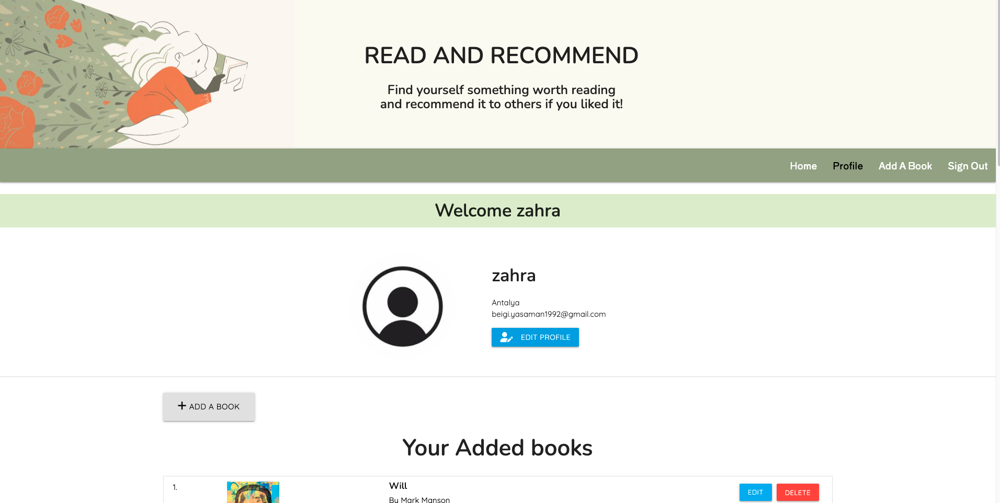
*  #### Profile Page provides:  
    * Users account details such as username, location, and email address.
    * An "Edit Profile" button that navigates to the edit profile page where users can change their profile.
    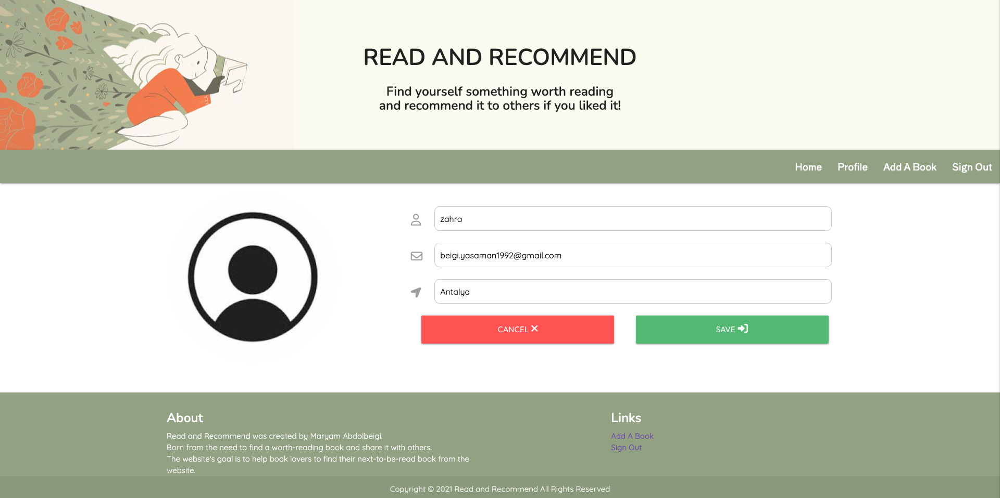
    * The "Edit Profile" button navigates to a page with a form where the inputs are pre-filled with the users' detail and the user is able to change their profile.
    * If the user enters a username that already exists in the database a message will pop up on the page alerting the user that the username already exists and returns to the page.
    * If the form after validation is successfully updated the user will be navigated to the profile page with the updated data and a message that confirms that the profile is updated.
    * If there is no change in the form, the user will be redirected to the profile page with the existing data.
    * The "Cancel" button works in the same way as if there is no change in the form and it redirects to the profile page with the existing data.
    * An "Add a Book" button that redirects to the add a book page.
    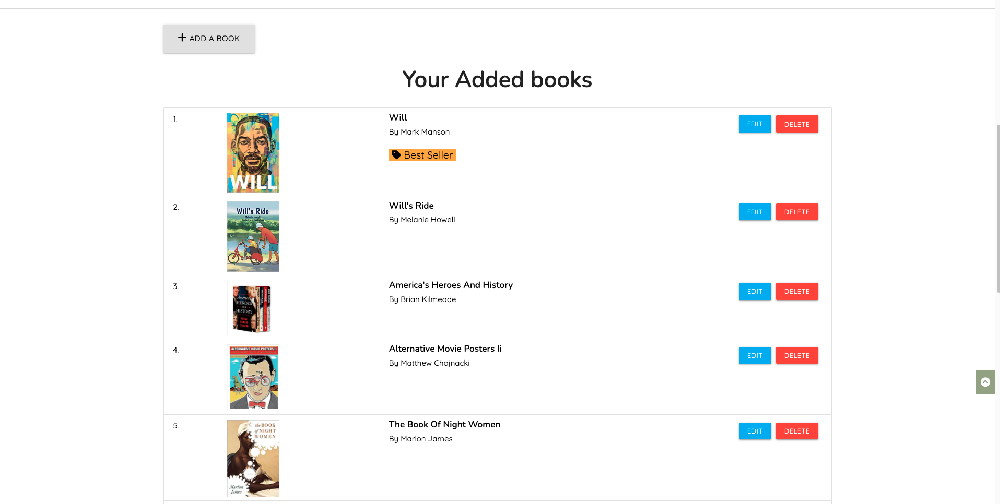
    * In this section, all the books that are added by the user are displayed in a list featured with "Edit" and "Delete" buttons which enables the user to modify the book.
    * The list items are wrapped in a link that navigates to the book detail page.
    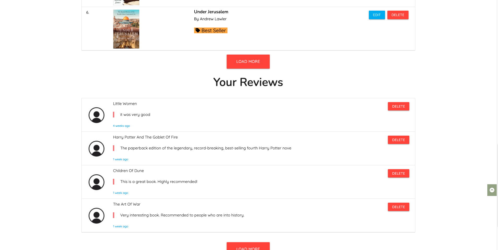
    * In this section, all the reviews composed by the user are displayed in a list featured with a "Delete" button which enables users to remove the review.
    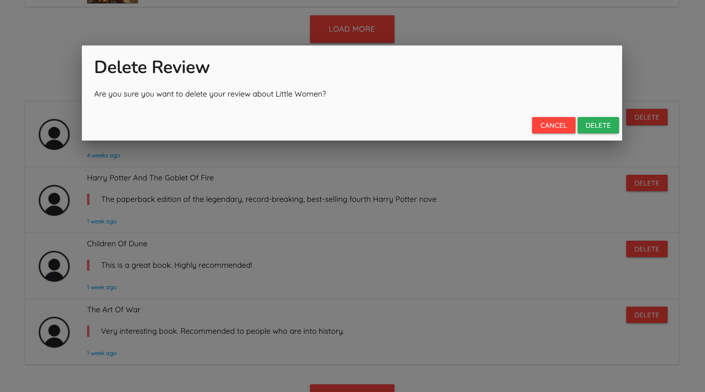
    * The "Delete" button opens to a modal to confirm the review deletion.

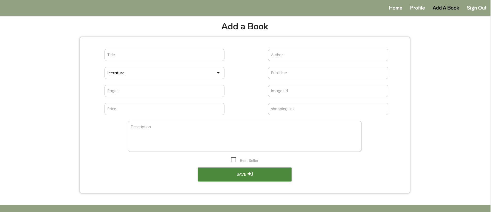
*  #### Add a Book Page provides:  
    * A form with which users can add a book to the webite.
    * There is a label for each input that guides users to the type of the expected information for each field and, the form will not be submitted unless all the fields are validated.
    * In the event that the book title already exists in the database, a message will be shown to the user informing them about the issue.
    * A check box is featured in the form to mark the best seller books.

*  #### Sign-Up Page provides:  
    * A registration form with which users can register and make an account.
    * The form checks if the username already exists in the database and shows a message to the user in that case.
    * The form will not be submitted unless are the fields are validated and correctly filled.
    * After the submission, the user will be navigated to the profile page with their account detail.
    * There is a shortcut link to the login page if the user already has an account.

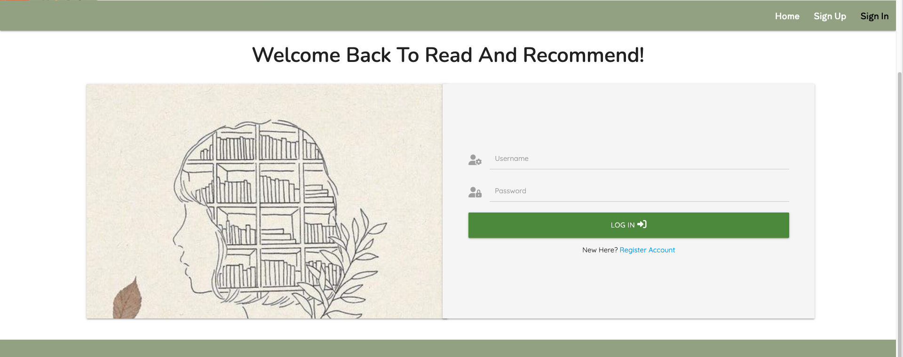
*  #### Sign-In Page provides:  
    * A login form with which users can sign-in to their account.
    * In case the username and/if the password is incorrect, a message will be shown to the user informing them about the issue.
    * In this form the account data in the database are checked with the user's input and log into the account if they match. 
    * There is a shortcut link to the sign-up page for users who have not registered yet.

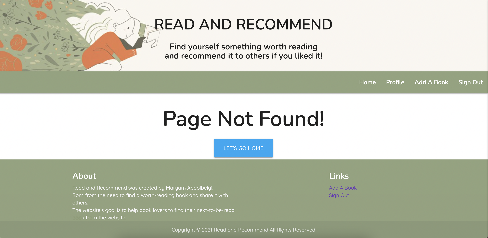
*  #### Custom 404 Page:
    * The custom 404 page prevents users from confusion and redirects them to the home page if the URL is unavailable or does not exist.

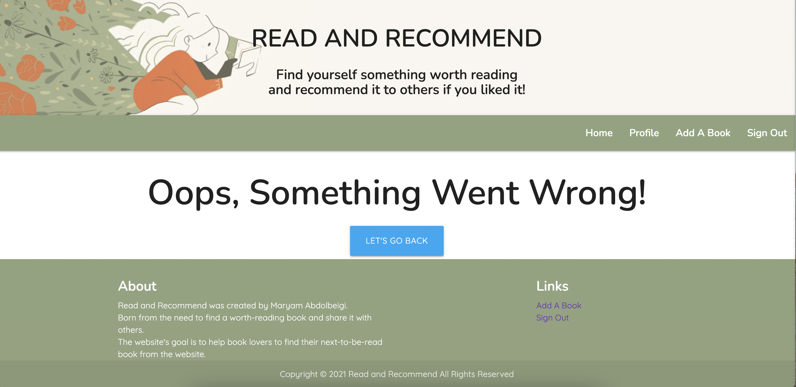
*  #### Custom 500 Page:
    * The custom 500 page prevents users from confusion and redirects them to the home page when an error occurs.

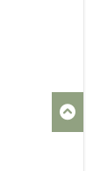
*  #### Back To Top Button: 
    * A back-to-top button is featured on all pages to enable users to jump to the top of the page quickly without the need to scroll all the way up to the page.

*  #### Footer:
    * The footer is identical on all pages and it provides a brief description of the website as well as some quick access links that differ on every stage of the website.
    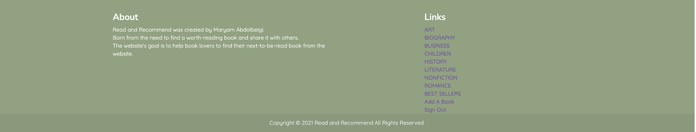
    * The footer contains links to all book categories on the home page and excludes them on all other pages.
    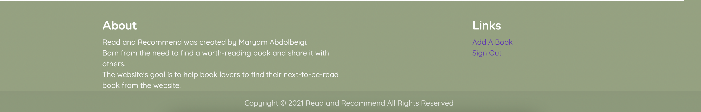
    * The quick access links in the footer alters according to the navigation bar links on different pages.

### Yet to be implemented
   1. Enable users to upload images to the website instead of an image URl.
   2. On Create Account Page, add ability to see the password that was typed in, to avoid accidental typos.
   

## Technologies Used

### Languages
- HTML5
- CSS
- JavaScript
- Python3
- Dockerfile

### IDE
- VScode

### Frameworks, Libraries, CDN's, resources:

1. [Materialize]()       
- This was used for the main layout, forms, alerts and other elements. 

2. [Balsamiq](https://balsamiq.com/wireframes/)         
- This was used to create mockups during the design process.      

3. [GitHub](https://github.com/)         
- Github was used as a remote repository and to deploy the website.      

4. [Git](https://git-scm.com/)         
- Git was used as version control to keep track of files and push them to the remote repository.      

5. [FontAwesome](https://fontawesome.com/start)         
- Font Awesome was used throughout the website to add icons.      

6. [Google Fonts](https://fonts.google.com/)         
- Google fonts were used to import the font styles in the website.      

7. [Chrome Developer Tools:](https://developer.chrome.com/docs/devtools/)        
- This was used for debugging and for checking the responsiveness of the website.      

8. [Ami Responsive](http://ami.responsivedesign.is/)         
- This was used to test the website responsiveness.      

9. [HTMLValidationService](https://validator.w3.org/)     
- This was used to check the markup validity of the web documents.      

10. [CSSValidationService](https://validator.w3.org/)      
- This was used to check the markup validity of the web documents.      

11. [Coolors.co](https://coolors.co/eae8ed-bcdadd-b3d1bb-62a9af-af70c2-500966)     
- This was used to choose the color theme used in the website.      

12. [Unicorn Revealer Extention](https://chrome.google.com/webstore/detail/unicorn-revealer/lmlkphhdlngaicolpmaakfmhplagoaln?hl=en-GB)        
- This is a developer-friendly tool to locate the overflows and was used throughout the process.              

13. [w3schools](https://www.w3schools/)         
- This was used for documentation for most troubles and errors.      

14. [jQuery](https://jquery.com/)      
- This was used as Javascript library to write less Javascript codes.          

15. [Pinterest](https://nl.pinterest.com/)        
- This was used to download images for the website.      

16. [favicon.io](https://favicon.io/)       
- This was used to create and insert a favicon.      

17. [draw.io](https://app.diagrams.net/)
- This was used to create the flowchart for register and login functions.

18. [Mongodb](https://cloud.mongodb.com/)
- Mongodb Atlas was used as a cloud database in this project.

19. [PyMongo](https://pymongo.readthedocs.io/en/stable/)
- This was used to make communication between Python and MongoDB possible.

20. [Flask](https://pymongo.readthedocs.io/en/stable/)
- This was used to construct and render pages.

21. [Jinja](https://jinja.palletsprojects.com/en/3.0.x/)
- This was used to simplify displaying data from the backend of this project smoothly and effectively in html.

22. [Wtforms](https://wtforms.readthedocs.io/en/2.3.x/)
- This was used to construct forms in this project.

23. [Werkzeug](https://werkzeug.palletsprojects.com/en/2.0.x/)
- This was used to generate and check hashing passwords in the sign In/Up functions. 

24. [Heroku](https://dashboard.heroku.com/login)
- This was used as the deployment platform.

## Testing
Testing information can be found in a separate [TESTING.md file](TESTING.md)
## Deployment

### Github
1. Log into Github and locate the relevant repository.
2. Click on the settings buttons on the menu.
3. Scroll down to the "Github pages".
4. Click on the link "Check it out here".
5. Change the branch from "none" to "main/master".
6. Click on the "save" button.
7. It might take a couple of minutes to retrieve the link to the published website in a green box.
8. Add the link of the website to the "About" section of the repository and include a short description of the project.
9. Click "Save Changes" and the link will be available in the About section of the repository.

### Forking the GitHub Repository
1. Sign in to GitHub and locate the GitHub Repository.
2. Go to the top right side of the screen and below the navigation bar is the "Fork" button.
3. After clicking this, you will now have a copy of the original Repository in your GitHub account.

### Local Clone
This is used to make changes to the project code.

1. log in to Github and locate the intended repository.
2. Above the Repository files, click on the "Code" button.
3. You then see three options, HTTPS, SSH and GitHub CLI. Select one and copy the URL.
4. Open a new terminal on Git Bash.
5. Now change the current working directory to the location you'd like the cloned directory to be made.
6. Type git clone, and then paste the URL you copied from the remote repository.

`$ git clone https://github.com/Yasi92/read-and-recommend.git`

### Author 

## Credits

- [Stackoverflow](https://stackoverflow.com/)
- [w3schools](https://www.w3schools/howto/tryit.asp?filename=tryhow_js_scroll_to_top)

## Content
                   
         

## Media
 The photots throughout the website were taken from:
- [Pexels](https://www.pexels.com/)  
- [Pinterest](https://nl.pinterest.com/)

## Acknowledgements

- Tutors at Code Institute for their continued support.
- Code Institute's Slack community was a great help every step of the way during the project.
- Stack Overflow.
- My mentor Richard Will.
- Code Institute's Slack community was a great help every step of the way during the project.

